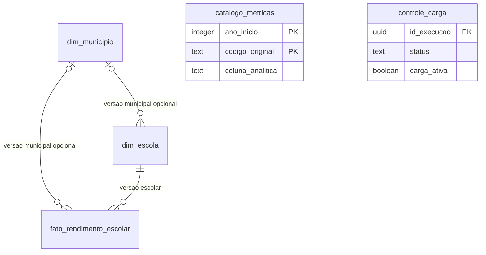

# Modelo PostgreSQL e estratégia de carga

Este documento explica o modelo relacional da camada analítica e o contrato da carga. A estrutura das cinco tabelas está definida em [schema.sql](../src/pipeline/banco/schema.sql), preservado nesta implementação. O carregador, a staging e a publicação transacional estão em [persistencia.py](../src/pipeline/persistencia.py). As instruções estão no [README](../README.md#etapa-6--persistência-postgresql); os resultados reais estão no [diário técnico](diario_tecnico.md).

## Escopo e fontes

Fluxo aprovado: INEP → pipeline Python → histórico Parquet → camada analítica Parquet → PostgreSQL → Power BI.

O histórico completo `data/processed/taxas_rendimento_escolar_consolidada.parquet` continuará exclusivamente em Parquet. O banco receberá somente a camada analítica publicada em `data/processed/dashboard/`: `taxas/ano=<ano>/taxas.parquet`, `dim_escolas.parquet`, `dim_municipios.parquet` e `dim_metricas.parquet`. O nome da pasta não significa dashboard implementado. Não haverá novos indicadores, médias, agregações ou transformação das taxas em formato long.

Referências locais: [contrato de dados](dicionario_dados.md), [catálogo executável](../src/pipeline/metricas.py), [geração das dimensões](../src/pipeline/camada_analitica.py) e `outputs/relatorios/schema_consolidacao.json`. Os Parquets existentes não serão alterados pela carga.

## Compatibilidade com os Parquets

A publicação validada contém 18 partições (2007–2024), 2.588.324 linhas analíticas, 515.873 versões escolares para 227.868 códigos distintos, 11.245 versões municipais para 5.570 códigos distintos e 270 registros de catálogo. A fato possui 54 métricas float64, identificadores textuais e ano int32 recuperado das partições Hive. Esses números descrevem a base de referência, não constantes a impor a futuras cargas.

O modelo inicial é compatível com os dados publicados, com os seguintes cuidados:

1. `id_escola` e `id_municipio` identificam versões de atributos, não códigos únicos de entidades nem intervalos de vigência. Preservar exatamente os hashes SHA-256 existentes, sem gerar IDs substitutos. Nunca impor UNIQUE somente a `co_entidade` ou `co_municipio` nas dimensões.
2. A dimensão escolar de origem não possui `id_municipio`. A carga deverá derivar essa referência a partir dos quatro atributos municipais e da dimensão municipal existente. Todas as 515.873 versões escolares atuais possuem código municipal e correspondência pelo conjunto completo de atributos.
3. O contrato também admite escolas sem município identificado. Elas podem carregar nome municipal, UF ou região mesmo sem código. Uma normalização que remova esses atributos da escola perderia informação quando não houver dimensão municipal referenciada.
4. As duas FKs municipais propostas não garantem sozinhas que a fato e a versão escolar apontem para o mesmo município. A carga precisa verificar a igualdade considerando NULL.
5. O catálogo possui vários registros para uma mesma coluna analítica, separados por alias/período. Uma junção da fato wide a esse catálogo apenas por nome de coluna multiplicaria linhas.
6. Os códigos malformados são avisos no contrato atual, não motivo de descarte. Não acrescentar restrições de tamanho ou formato aos códigos INEP que rejeitem dados permitidos pela Etapa 5. Essa regra não se aplica aos hashes, cujo formato é definido pela própria pipeline.

### Atributos municipais da versão escolar

`id_municipio` é FK opcional na dimensão escolar; `co_municipio`, `no_municipio`, `sg_uf` e `no_regiao` permanecem na versão escolar como informação histórica e rastreável. Isso preserva todo o contrato, inclusive os casos de município ausente, sem inventar município, hash ou valor sentinela. A redundância deverá ser conferida pelas validações de carga; inconsistências não autorizam reparo ou descarte silencioso.

A normalização total poderá ser reavaliada quando os dados demonstrarem que a relação é sempre válida, com tratamento sem perda para todos os casos admitidos pelo contrato e aprovação explícita da mudança. A remoção dos atributos não está aprovada. A decisão atual não altera os Parquets nem permite descartar escolas com dados parciais.

## Modelo relacional

As tabelas abaixo são definidas pelo script SQL e precisam ser criadas em cada ambiente antes da carga. `text` preserva códigos, nomes e hashes sem padding ou conversão numérica. Todos os IDs dimensionais usam `text` com verificação do formato `^[0-9a-f]{64}$`; entre os IDs, NULL é permitido apenas nas referências municipais. Nenhum código recebe preenchimento de zeros ou normalização adicional.

Catálogo e controle não precisam de FK para cada linha da fato. O banco conterá uma publicação analítica vigente; o controle identificará qual execução a publicou.

### dim_municipio

| Coluna | Tipo PostgreSQL | Nulo? | Regra |
| --- | --- | --- | --- |
| `id_municipio` | text | Não | PK; SHA-256 original. |
| `co_municipio` | text | Não | Código da fonte; não é UNIQUE. |
| `no_municipio` | text | Sim | Atributo da versão. |
| `sg_uf` | text | Sim | Preservar inclusive valores com aviso. |
| `no_regiao` | text | Sim | Atributo da versão. |

### dim_escola

| Coluna | Tipo PostgreSQL | Nulo? | Regra |
| --- | --- | --- | --- |
| `id_escola` | text | Não | PK; SHA-256 original. |
| `co_entidade` | text | Não | Código escolar; pode repetir entre versões. |
| `no_entidade` | text | Sim | Nome observado na versão. |
| `id_municipio` | text | Sim | FK para `dim_municipio(id_municipio)`. |
| `tipoloca` | text | Sim | Valor da camada analítica. |
| `dependad` | text | Sim | Valor já harmonizado pela Etapa 5. |
| `co_municipio` | text | Sim | Preservação da origem; NULL junto com a FK municipal. |
| `no_municipio` | text | Sim | Preservação, inclusive quando falta código municipal. |
| `sg_uf` | text | Sim | Preservação da origem. |
| `no_regiao` | text | Sim | Preservação da origem. |

Prever UNIQUE (`id_escola`, `co_entidade`) como alvo da FK composta da fato. Embora a PK já torne cada ID único, a restrição composta permite que o banco assegure a associação entre ID e código escolar. Verificar também `(id_municipio IS NULL) = (co_municipio IS NULL)` na própria linha.

Derivação da FK municipal: associar (`co_municipio`, `no_municipio`, `sg_uf`, `no_regiao`) ao mesmo conjunto na dimensão de municípios, com comparação que trate dois NULLs como iguais (`IS NOT DISTINCT FROM`). Exigir uma única correspondência para cada escola com código municipal; zero ou múltiplas correspondências bloqueiam a carga. Se o código for NULL, a FK será NULL e os demais atributos serão preservados. Não juntar somente por código, escolher a versão mais recente ou recalcular `id_escola` depois da projeção relacional.

### fato_rendimento_escolar

| Coluna | Tipo PostgreSQL | Nulo? | Regra |
| --- | --- | --- | --- |
| `ano` | integer | Não | Obtido do caminho Hive e conferido com os anos do lote. |
| `co_entidade` | text | Não | Código da escola observado no ano. |
| `id_escola` | text | Não | Referência à versão escolar. |
| `id_municipio` | text | Sim | FK para `dim_municipio(id_municipio)`. |
| Cada uma das 54 métricas abaixo | double precision | Sim | Copiar float64, sem arredondamento, médias ou preenchimento com zero. |

PK (`ano`, `co_entidade`) estabelece a unicidade solicitada e dispensa outro UNIQUE igual. Não substituir por (`ano`, `id_escola`): versões distintas não autorizam duas observações da mesma escola no mesmo ano. FK (`id_escola`, `co_entidade`) → `dim_escola(id_escola, co_entidade)` assegura a referência escolar e o código simultaneamente.

Nomes exatos das 54 colunas:

| Recorte | Aprovação | Reprovação | Abandono |
| --- | --- | --- | --- |
| Fundamental total | `tap_fun` | `tre_fun` | `tab_fun` |
| Anos iniciais | `tap_fun_ai` | `tre_fun_ai` | `tab_fun_ai` |
| Anos finais | `tap_fun_af` | `tre_fun_af` | `tab_fun_af` |
| 1º ano | `tap_fun_01` | `tre_fun_01` | `tab_fun_01` |
| 2º ano | `tap_fun_02` | `tre_fun_02` | `tab_fun_02` |
| 3º ano | `tap_fun_03` | `tre_fun_03` | `tab_fun_03` |
| 4º ano | `tap_fun_04` | `tre_fun_04` | `tab_fun_04` |
| 5º ano | `tap_fun_05` | `tre_fun_05` | `tab_fun_05` |
| 6º ano | `tap_fun_06` | `tre_fun_06` | `tab_fun_06` |
| 7º ano | `tap_fun_07` | `tre_fun_07` | `tab_fun_07` |
| 8º ano | `tap_fun_08` | `tre_fun_08` | `tab_fun_08` |
| 9º ano | `tap_fun_09` | `tre_fun_09` | `tab_fun_09` |
| Médio total | `tap_med` | `tre_med` | `tab_med` |
| 1ª série | `tap_med_01` | `tre_med_01` | `tab_med_01` |
| 2ª série | `tap_med_02` | `tre_med_02` | `tab_med_02` |
| 3ª série | `tap_med_03` | `tre_med_03` | `tab_med_03` |
| 4ª série | `tap_med_04` | `tre_med_04` | `tab_med_04` |
| Médio não seriado | `tap_med_ns` | `tre_med_ns` | `tab_med_ns` |

As correspondências históricas série/ano continuam sendo as do catálogo atual. Para cada taxa, prever CHECK equivalente a `taxa IS NULL OR (taxa >= 0 AND taxa <= 100)`. No PostgreSQL, isso também rejeita infinitos e NaN não nulos. Distinguir a ausência Arrow, convertida em SQL NULL, de um NaN que seja valor válido no arquivo: este último deve bloquear a carga, não virar NULL silenciosamente. `double precision` acompanha a representação float64 existente; adotar decimal com escala fixa imporia uma regra nova de arredondamento. [Tipos numéricos do PostgreSQL](https://www.postgresql.org/docs/current/datatype-numeric.html).

Os demais atributos da fato Parquet serão validados contra as dimensões antes de serem omitidos da tabela relacional. A projeção não pode esconder divergências. Preservar `id_municipio` na fato conforme proposto, mas exigir igualdade com o município da versão escolar, inclusive quando um dos lados for NULL.

### catalogo_metricas

| Coluna | Tipo PostgreSQL | Nulo? |
| --- | --- | --- |
| `codigo_original` | text | Não |
| `coluna_analitica` | text | Não |
| `ano_inicio` | integer | Não |
| `ano_fim` | integer | Não |
| `tipo_taxa` | text | Não |
| `etapa_ensino` | text | Não |
| `detalhamento` | text | Não |
| `descricao` | text | Não |
| `observacao` | text | Não |

PK (`ano_inicio`, `codigo_original`); CHECK `ano_inicio <= ano_fim`. Copiar os 270 registros atuais, sem resumir para 54. Os anos int64 da origem cabem em integer; validar o intervalo antes da conversão. Verificar na carga sobreposição de períodos para um mesmo alias e correspondência de `coluna_analitica` às 54 colunas. Não adicionar FK com a fato wide, nem UNIQUE apenas por alias ou coluna analítica.

### controle_carga

| Coluna | Tipo PostgreSQL | Nulo? | Significado |
| --- | --- | --- | --- |
| `id_execucao` | uuid | Não | PK; gerado pelo carregador, sem exigir extensão. |
| `inicio` | timestamptz | Não | Instante de início. |
| `fim` | timestamptz | Sim | Preenchido quando a execução terminar. |
| `status` | text | Não | `em_execucao`, `sucesso`, `falha` ou `interrompida`. |
| `carga_ativa` | boolean | Não | Padrão false; identifica a publicação vigente. |
| `quantidade_linhas` | bigint | Sim | Total de linhas da fato publicadas por esta execução. |
| `quantidade_escolas` | bigint | Sim | Total de versões em `dim_escola`, não códigos distintos. |
| `quantidade_municipios` | bigint | Sim | Total de versões em `dim_municipio`. |
| `quantidade_codigos_escola` | bigint | Sim | Códigos escolares distintos. |
| `quantidade_codigos_municipio` | bigint | Sim | Códigos municipais distintos. |
| `quantidade_metricas_catalogo` | bigint | Sim | Linhas do catálogo, não número de colunas de taxas. |
| `versao_pipeline` | text | Não | Versão identificável do código usado na carga. |
| `commit_pipeline` | text | Sim | Commit do carregador, quando disponível. |
| `codigo_modificado` | boolean | Sim | Indica alterações locais além do commit; NULL se desconhecido. |
| `manifesto_origem` | jsonb | Não | Arquivos relativos, hashes SHA-256, schemas, anos, contagens esperadas e identidade da origem. |
| `validacoes` | jsonb | Sim | Contagens observadas por tabela/ano, nulos por métrica, avisos e divergências. |
| `mensagem_erro` | text | Sim | Motivo de falha/interrupção, sem credenciais. |

As contagens publicadas ficam NULL em tentativas sem sucesso; contagens parciais/esperadas ficam em `validacoes`/`manifesto_origem`. Prever CHECKs de contagens não negativas, `fim >= inicio` quando preenchido, status no conjunto declarado, estados terminais com `fim` e `carga_ativa` somente quando `status = 'sucesso'`. Sucesso exige todas as contagens preenchidas.

Índice UNIQUE parcial em `carga_ativa` onde `carga_ativa = true` permite no máximo uma publicação vigente. Execuções anteriores bem-sucedidas permanecem no histórico com `carga_ativa=false`. Cada tentativa terá novo UUID: idempotência significa mesmo conteúdo analítico, não ausência de novas linhas de auditoria.

O commit atual do repositório não comprova qual código produziu Parquets antigos. Registrar a versão produtora no manifesto apenas quando houver evidência; caso contrário, identificá-la como desconhecida e preservar os hashes da origem. Um commit com mudanças locais também não identifica sozinho o código efetivo.

### Restrições e índices

PKs e UNIQUEs criam seus próprios índices; não duplicá-los. FKs não criam automaticamente índices nas colunas que referenciam outras tabelas. Não usar CHECK com consulta a outra tabela. [Restrições do PostgreSQL](https://www.postgresql.org/docs/current/ddl-constraints.html).

Índices B-tree adicionais propostos:

| Tabela | Colunas | Finalidade |
| --- | --- | --- |
| `dim_escola` | `id_municipio` | Junção municipal e suporte à FK. |
| `fato_rendimento_escolar` | `id_escola, co_entidade` | Junção com a versão escolar e suporte à FK composta. |
| `fato_rendimento_escolar` | `id_municipio` | Junção municipal e suporte à FK. |

A PK da fato começa por ano e atende filtros por ano. Índices por código escolar isolado, UF, nomes, status de carga ou outras combinações dependerão das consultas reais; não são necessários para a primeira carga. Não indexar as 54 taxas nem particionar o PostgreSQL só porque o Parquet está particionado.

Todas as FKs usarão `ON DELETE NO ACTION` e `ON UPDATE NO ACTION`, sem cascata. A consistência entre fato, escola e município, incluindo os atributos redundantes, será uma condição obrigatória de publicação validada por consultas antes do commit, com `IS DISTINCT FROM` para detectar divergências inclusive de NULL. Ela não estará assegurada apenas pelas FKs. O acesso de escrita às tabelas analíticas será exclusivo do carregador; consumidores serão somente leitura. Caso se permita outra forma de escrita futuramente, será preciso aprovar mecanismos adicionais de integridade, como triggers, antes de liberar esse acesso.

No futuro Power BI, a relação direta município–fato e a relação município–escola–fato não devem ser configuradas automaticamente como dois caminhos ativos de filtro. A escolha do caminho pertence à modelagem semântica posterior; não altera a integridade relacional proposta aqui.

## Estratégia de carga

Estratégia implementada: substituição completa da publicação analítica, sem append ou UPSERT. Reduções de período ou contagens em relação à carga ativa bloqueiam a substituição até a revisão explícita da origem; o comando não fornece bypass automático. Tempos reais constam no diário técnico; dimensionamento de espaço e WAL depende do ambiente.

### 1. Fixar e identificar a origem

Exigir `TOTAL.publicado=True` e status `ok` ou `aviso`, guardando os avisos e o schema junto ao manifesto. O relatório isolado não prova que todos os arquivos pertencem à mesma publicação. A carga deverá operar em janela sem execução/publicação da Etapa 5, ler uma cópia imutável da camada analítica e conferir os hashes antes e depois da captura. Não basta ler arquivos enquanto a Etapa 5 os substitui individualmente.

Não modificar os arquivos de origem. Registrar a lista completa de partições, contagens e hashes; ler `ano` com Hive. Conferir o conjunto de anos contra a publicação vigente: redução de período ou mudanças relevantes de contagem exigirão revisão explícita da origem antes de substituir o banco, sem limites numéricos arbitrários. Primeira carga com base vazia ou sem os produtos exigidos deve falhar.

### 2. Registrar execução e carregar staging

Serializar cargas com um lock de aplicação no PostgreSQL, por exemplo advisory lock de sessão, mantido durante toda a operação e liberado ao fim ou ao encerrar a sessão. O mecanismo só coordena participantes que o respeitam; permissões devem impedir outros escritores. [Locks explícitos](https://www.postgresql.org/docs/current/explicit-locking.html).

Inserir o controle `em_execucao` e confirmar esse registro em transação própria antes da carga. Usar staging temporária isolada por sessão, uma tabela para cada produto, mantendo todos os atributos de origem e preservando linhas entre commits durante a preparação. Não compartilhar staging entre execuções.

O carregador lê Parquet em lotes e envia os valores por `psycopg` 3 e `COPY FROM STDIN`, com strings Unicode, float64 sem arredondamento e NULL explícito. PostgreSQL COPY não recebe arquivos Parquet diretamente. Nenhum erro de conversão é descartado e strings vazias não viram NULL. A transferência inteira é conferida com digest SHA-256 de linhas tipadas lidas de volta da staging na ordem original. [COPY](https://www.postgresql.org/docs/current/sql-copy.html).

### 3. Validar staging

Antes de tocar nas definitivas, conferir:

- Arquivos, schemas e conjunto exato de 54 métricas; anos físicos recuperados das partições e coerentes com o manifesto.
- Contagens totais e por ano entre metadados/leituras Parquet e staging; igualdade das contagens dimensionais e do catálogo. Comparar versões e códigos distintos separadamente.
- Ausência de duplicidades por (`ano`, `co_entidade`), por IDs dimensionais e por chave do catálogo; nulos nas chaves obrigatórias e formato dos hashes.
- Todas as referências, igualdade entre código escolar da fato e da versão escolar, igualdade municipal entre fato e escola com tratamento de NULL e igualdade dos atributos redundantes da fato com as dimensões.
- Correspondência única dos quatro atributos municipais da escola com a dimensão quando o código existe. Escolas sem código permanecem com FK nula e atributos parciais preservados.
- Ausências por métrica e ano, valores finitos em [0,100] e preservação dos códigos como texto. Códigos e UFs com avisos mantêm o valor de origem, sem reparo automático.
- Catálogo integral, períodos coerentes e nomes de colunas existentes; IDs já conhecidos não podem reaparecer com conteúdo diferente sob o mesmo hash.

Qualquer violação bloqueante interromperá a carga inteira; não deduplicar nem ignorar linhas para fazer as contagens coincidirem. Totais iguais não bastam: comparar também chaves, atributos e métricas. O carregador deverá confirmar a fidelidade Parquet–staging por lotes e comparação tipada, com NULL explícito; strings e IDs sem transformação, float64 sem arredondamento.

### 4. Publicar em uma única transação

Somente após staging aprovada:

1. Iniciar a transação de publicação, mantendo o lock exclusivo entre carregadores. As tabelas de staging permanecem imutáveis nesta fase.
2. Remover linhas definitivas na ordem fato → escola → município; remover também o catálogo. Usar DELETE dentro da transação, não DROP/recriação nem commits entre tabelas.
3. Inserir município → escola → catálogo → fato, com todas as restrições ativas. Importar as dimensões completas, não apenas subconjuntos escolhidos pela fato.
4. Comparar definitivas e staging na mesma transação: totais, contagens por ano, versões, códigos distintos, nulos, chaves e conteúdo. Comparação em ambas as direções, como `EXCEPT ALL` sobre colunas tipadas, deverá retornar zero linhas; as checagens de relacionamento também deverão retornar zero divergências.
5. Marcar a execução anterior como inativa; marcar a atual como `sucesso`, preencher contagens/fim e ativá-la. Essas mudanças no controle pertencem à mesma transação dos dados.
6. Efetuar um único COMMIT. Depois, liberar staging e lock. Atualizar estatísticas quando necessário; falha nessa manutenção posterior não desfaz nem reclassifica uma publicação já confirmada.

DELETE + INSERT foi escolhido para manter as tabelas e relações estáveis e permitir leitura da versão anterior durante a transação. TRUNCATE pode ser revertido, mas possui particularidades de MVCC e bloqueio que não são desejadas neste desenho inicial. A opção poderá ser revista apenas com medição e aprovação. [TRUNCATE](https://www.postgresql.org/docs/current/sql-truncate.html).

## Rollback, interrupção e idempotência

Falha antes da publicação não altera as tabelas definitivas. Falha entre o início da transação e o commit exige ROLLBACK: remoções, inserções e mudança de carga ativa serão revertidas juntas, mantendo a publicação anterior. A primeira carga com falha mantém o banco sem publicação analítica. [Transações](https://www.postgresql.org/docs/current/tutorial-transactions.html).

Após o rollback, registrar `falha`, fim e mensagem de erro em nova transação de controle; caso o registro estivesse na transação revertida, o diagnóstico desapareceria. Se a conexão cair ou o processo morrer, pode permanecer `em_execucao`. A próxima execução deverá obter o mesmo lock e reconciliar esse registro antes de prosseguir.

Se a conexão cair durante COMMIT, o cliente pode não saber se ele foi confirmado. Consultar o controle pelo UUID em nova conexão: `sucesso` confirma que dados e controle foram publicados juntos, ainda que uma carga posterior já o tenha tornado inativo. Não presumir falha nem sobrescrever esse sucesso. Um registro abandonado em `em_execucao`, após verificar que a sessão anterior terminou, poderá ser marcado `interrompida`. Sem acesso ao banco, manter o resultado como indeterminado até a reconciliação.

Reexecutar a mesma origem substituirá o conteúdo pelo mesmo conjunto de linhas, sem duplicação. Cada tentativa gera novo controle. Registros obsoletos não permanecem por acidente, pois o lote completo validado substitui o anterior. Não será necessário manter múltiplas cópias definitivas para rollback de uma carga não confirmada; recuperação de erro descoberto depois de um commit é outra operação, baseada em origem anterior preservada/backups, não um ROLLBACK tardio.

Leitores não enxergam alterações não confirmadas, mas consultas distintas sob Read Committed podem atravessar a fronteira de um commit. Uma futura atualização do BI que precise de uma única versão em várias consultas deverá usar uma transação de leitura Repeatable Read quando suportada, ou ser coordenada fora da janela de publicação. Não prometer consistência de toda uma atualização do Power BI apenas pela atomicidade do commit. [Isolamento de transações](https://www.postgresql.org/docs/current/transaction-iso.html).

## Estado da implementação e critérios de aceitação

Estão disponíveis no repositório o script SQL e o carregador. Os testes automatizados são mantidos somente no ambiente local e não são distribuídos com o repositório. Criar banco e usuário e executar o schema continuam sendo procedimentos externos à pipeline. `python main.py --etapa 6` executa somente a persistência dos produtos publicados pela Etapa 5. O comando sem argumentos mantém seu comportamento anterior, sem carga automática no banco.

O contrato da persistência exige:

- Criar staging temporária e transferir lotes usando `psycopg` e `COPY`, com validação antes da publicação. `pandas.to_sql()` não será o mecanismo principal.
- Registrar o início em `controle_carga` em transação própria; confirmar sucesso junto aos dados e registrar falha após rollback.
- Respeitar permissões e limites de espaço para staging, tabelas e WAL definidos para o ambiente de destino.
- Testar duplicidades, nulos, versões históricas, códigos com zeros, falhas após DELETE e durante inserção, concorrência e resultado indeterminado do commit.
- Demonstrar duas cargas da mesma origem com conteúdo idêntico e controles distintos; provar que uma carga com falha mantém a publicação anterior ativa.
- Registrar tempos e contagens reais antes de conectar o Power BI.

O carregador implementa captura temporária verificada por hashes, staging isolada por sessão, fidelidade Parquet–staging, validações de conteúdo e relações, publicação atômica e reconciliação de resposta perdida ao COMMIT. A staging conserva os atributos redundantes da fato até a validação; a FK municipal escolar é derivada somente por correspondência única dos quatro atributos. A comparação final usa FULL JOIN por chaves validadas como únicas e não nulas, com IS DISTINCT FROM em todas as colunas e contagens iguais: detecta diferenças e linhas ausentes em ambas as direções sem transformar valores.

Os testes de integração usam schemas descartáveis, cobrindo rejeições na staging e rollback depois das exclusões e inserções dimensionais. Resultados da carga completa, reexecução e verificações independentes são registrados no diário técnico. A captura deve ocorrer fora de uma publicação da Etapa 5; hashes não provam a versão produtora, registrada como desconhecida. Mudanças locais e commit referem-se ao carregador, não retroativamente aos Parquets.
